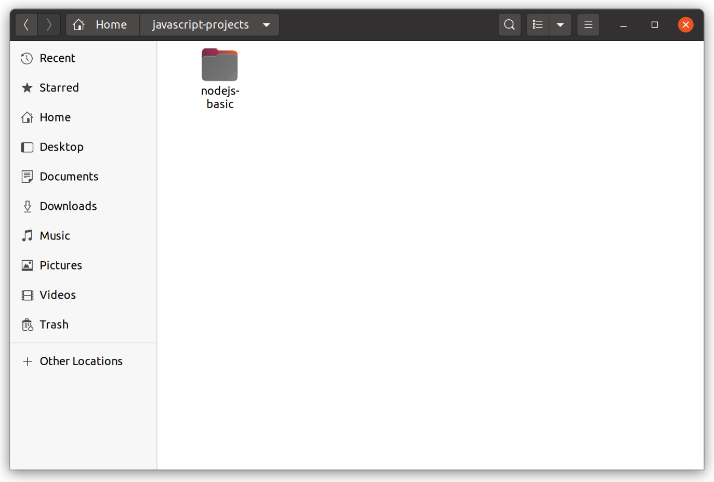

# Dasar-Dasar Node.js untuk Back-End

## Dasar-Dasar Node.js untuk Back-End

Setelah Anda mengetahui teori tentang back-end, server, pola komunikasi server dengan client, serta REST API, _what’s next_? Yup! selanjutnya untuk menjadi seorang Back-End Developer tentu Anda perlu mengetahui bekal yang harus dimiliki dalam membangun sebuah aplikasi back-end atau web service.

Kita akan menggunakan Node.js dalam membangun web service. Namun sebelum menyelami materi ini lebih jauh, mari kita pelajari terlebih dahulu beberapa dasar-dasar API yang ada pada Node.js. Beberapa dasar yang akan dipelajari kali ini akan sangat membantu kita dalam pengembangan web service nantinya.

Pada akhir modul ini, diharapkan Anda dapat:

* Mengetahui apa itu Node.js
* Mengeksekusi JavaScript dengan Node.js
* Mengetahui Node.js Global Object
* Memahami Modularization
* Menggunakan Node Package Manager
* Memahami Eventing
* Memahami Filesystem
* Memahami teknik Readable Stream dan Writable Stream

### Tools Belajar Dasar-Dasar Node.js untuk Back-End

Modul kali ini memiliki prasyarat sebelum Anda mengikutinya. Selain kemampuan JavaScript, terdapat dua tools yang perlu Anda siapkan, yakni Text Editor dan Node.js. Bila Anda sudah mengikuti seluruh latihan pada kelas Belajar Dasar Pemrograman JavaScript, tools ini seharusnya sudah terpasang pada komputer Anda. Bila belum, silakan unduh dan pasang dulu yah.

#### Text Editor

Selama mengikuti kelas ini, kami merekomendasikan Anda untuk menggunakan VSCode. Inilah text editor yang sangat populer dan gratis untuk digunakan. Selain itu, text editor ini memiliki plugin berlimpah yang dapat membuat fungsionalitas menjadi lebih kaya lagi. Visual Studio Code dapat dijalankan pada sistem operasi Windows, macOS, ataupun Linux. Untuk mengunduhnya, silakan kunjungi [laman unduh visual studio code](https://code.visualstudio.com/download).

#### Node.js

Pastikan komputer Anda sudah terpasang Node.js, jika belum silakan simak tautan bagaimana [cara memasang Node.js pada komputer Anda](https://www.dicoding.com/academies/256/freemodule/15830/). **Pastikan juga Node.js yang terinstal memiliki versi minimal 12 ke atas**. Untuk mengetahui versi Node.js yang Anda pasang, silakan tuliskan perintah ini pada Terminal atau CMD.

```bash
node -v
```

Sudah siap dengan prasyarat yang ada? Jika ya, yuk lanjut ke materi selanjutnya yah!

### Apa itu Node.js

Dari dulu hingga kini, browser menjadi tempat satu-satunya yang dapat mengeksekusi kode JavaScript. Karenanya, Web Developer perlu mempelajari bahasa pemrograman yang berbeda untuk mengembangkan aplikasi Front-End dan Back-End. Meskipun secanggih dan sekuat apa pun JavaScript berkembang, ia hanya akan digunakan di sisi Front-End saja.

Sebenarnya banyak developer yang mencoba membuat teknologi agar JavaScript dapat dijalankan di luar browser. Namun belum ada yang berhasil. Hingga pada tahun 2009, Ryan Dahl berhasil menciptakan [Node.js](https://nodejs.org/), teknologi yang diharapkan oleh banyak web developer. Tak disangka saat ini teknologi yang diciptakannya menuai popularitas tinggi. Node.js banyak digunakan oleh perusahaan besar sekelas Netflix, Uber, Paypal, dan eBay.

**Node.js berhasil menjadi JavaScript Runtime yang dapat mengeksekusi kode JavaScript di luar browser.** Node.js seolah-olah menjadi gerbang bagi para JavaScript Developer untuk mengembangkan sistem di luar dari browser. JavaScript menjadi bahasa multiplatform yang banyak menggiring developer untuk menggunakannya. Popularitas JavaScript pun meroket! Pada tahun 2014 hingga 2020 JavaScript menjadi bahasa pemrograman nomor satu yang banyak digunakan oleh developer. [\[1\]](https://octoverse.github.com/)

JavaScript menjadi salah satu pilihan tepat dalam membangun web server, terlebih bila Anda adalah seorang Front-End Web Developer. Anda tentu tidak perlu menggunakan bahasa yang berbeda dalam membangun Back-End. Anda bisa menjadi Full-Stack Developer dengan mempelajari satu bahasa pemrograman saja.

### Node.js Basic

Setelah mengenal Node.js kini saatnya kita belajar cara menggunakannya. Kita akan mulai dari membuat proyek Node.js, menjalankan kode JavaScript menggunakan Node.js, hingga mempelajari berbagai API yang ada di dalamnya. Jadi sekali lagi pastikan prasyarat yang ada sudah Anda penuhi yah. Siapkan Text Editor, dan kita akan mulai menuliskan kode JavaScript.

#### Membuat Proyek Node.js

Sebelum membuat proyek, buatlah folder baru terlebih dahulu. Folder ini akan digunakan sebagai tempat penyimpanan berkas proyek dan JavaScript yang kita tulis nanti. Kami sarankan, Anda buat folder tersebut di alamat _C -&gt; javascript-projects -&gt; nodejs-basic_ bagi pengguna Windows; _home -&gt; javascript-projects -&gt; nodejs-basic_ bagi pengguna Linux atau macOS.

**Windows**


**Linux**



**MacOS**


Selanjutnya, buka folder _nodejs-basic_ menggunakan VSCode. Caranya, pada Visual Studio Code pilih menu _File -&gt; Open Folder -&gt; \[pilih foldernya\]_. Folder pun berhasil terbuka melalui VSCode.


Untuk membuat proyek JavaScript, silakan buka Terminal pada VSCode. Pilih menu _Terminal -&gt; New Terminal_, kemudian tuliskan perintah:

```bash
npm init
```

> NPM alias Node Package Manager merupakan JavaScript Package Manager bawaan dari Node.js. Melalui NPM ini kita dapat membuat Node.js package \(proyek\) dan mengelola penggunaan package eksternal yang digunakan. Kita akan membahas NPM lebih detail nanti.

Jika Anda yang tidak menggunakan Visual Studio Code, gunakan Terminal/Command Prompt usungan OS Anda. Namun, sesuaikan lokasinya pada folder proyek ya.

Setelah menuliskan perintah di atas, Anda akan diberikan beberapa pertanyaan untuk mengisi nilai _package name, version, description_. Semua itu merupakan informasi dasar dari aplikasi yang Anda buat.


Nilai yang berada di dalam tanda kurung merupakan nilai _default_. Anda dapat menggunakan nilainya dengan langsung menekan tombol _Enter_. Untuk saat ini, cukup berikan semua pertanyaan dengan nilai _default_.

Setelah mengisi seluruh pertanyaan yang diberikan, Anda akan diberitahu untuk melihat hasil akhir yang dibuat pada berkas `package.json`.


Jika nilai yang ditampilkan sudah sesuai, langsung saja tekan tombol Enter. Berkas package.json pun telah berhasil dibuat pada proyek kita.


_Voila!_ Anda berhasil membuat proyek Node.js.

### Menjalankan JavaScript Menggunakan Node.js

Terdapat dua cara dalam menjalankan kode JavaScript menggunakan Node.js. Yang pertama dengan memanfaatkan Node REPL dan yang kedua dengan mengeksekusi berkas berekstensi JS. Mari kita kupas keduanya!

#### The Node.js REPL

Node.js memiliki fitur REPL atau **R**ead-**E**val-**P**rint **L**oop. Sesuai namanya, fitur ini berfungsi untuk membaca kode JavaScript, mengevaluasi kode tersebut, kemudian mencetak hasil evaluasinya ke console. Nah, untuk _loop_, berarti proses tersebut selalu berulang.

REPL merupakan fitur bawaan dari Node.js. Anda bisa mengaksesnya menggunakan perintah node pada Terminal.


Tanda &gt; pada Terminal menunjukan Anda sudah masuk ke mode Node REPL. Sekarang, Anda bisa menuliskan kode JavaScript dan mengeksekusinya dengan menggunakan _enter_.


Lihat gambar di atas. Ketika mengeksekusi console.log\(‘Hello NodeJS REPL’\), selain pesan “Hello NodeJS REPL”, nilai undefined juga tercetak. Hal tersebut karena REPL selalu menampilkan nilai evaluasi pada console. Karena method console.log\(\) tidak mengembalikan nilai, jadi undefined-lah yang tercetak pada console.

Untuk membuktikan hal itu, cobalah Anda tuliskan statement yang mengembalikan nilai. Contoh sederhananya 2+2. Maka nilai 4 akan tercetak pada console.


Cukup asik kan fitur REPL? Tapi kok terkesan hanya dapat mengeksekusi kode satu baris saja ya? Bila Anda beranggapan seperti itu, sebenarnya tidak tepat karena di dalam REPL terdapat mode editor yang berfungsi untuk menuliskan kode JavaScript lebih dari satu baris. Untuk menggunakan mode editor, Anda bisa tuliskan perintah .editor.


Ketika masuk ke mode editor, Anda bisa secara leluasa menuliskan kode JavaScript lebih dari satu baris menggunakan _enter_. Fungsi untuk mengeksekusi kode digantikan dengan kombinasi tombol _CTRL+D._ Untuk keluar dari mode editor, gunakan kombinasi _CTRL+C_.


Nilai variabel yang Anda buat di REPL dapat diakses selama Anda masih berada di dalam REPL. Jika Anda menutup Terminal atau keluar dari REPL menggunakan perintah .exit, variabel yang sudah Anda buat sebelumnya tidak bisa diakses kembali. Itu artinya, REPL hanya menyimpan memory ketika session masih berlangsung.

Fitur REPL sangat berguna ketika Anda hendak melakukan kalkulasi sederhana, bereksperimen, atau belajar potongan kode JavaScript. Karena melalui REPL Anda bisa mengeksekusi kode JavaScript dan mendapatkan hasil dengan cepat tanpa harus membuat berkas JavaScript terlebih dahulu.

#### Running JavaScript File using Node.js

Cara lain untuk mengeksekusi kode JavaScript menggunakan Node.js adalah melalui berkas JS. Silakan buat berkas JavaScript pada proyek nodejs-basic. Gunakan VSCode agar lebih mudah yah.


Buatlah berkas JavaScript dengan nama “**index.js**”.


Di dalam berkas index.js, Anda bisa menuliskan kode JavaScript sesuka Anda. Pastikan kode yang Anda tulis menampilkan nilai di console yah, jadi Anda bisa melihat nilai yang tampak pada console. Jika bingung, silakan tuliskan saja kode berikut.

**index.js**

```javascript
const message = (name) => {
   console.log(`Hello ${name}`);
}

message('JavaScript');
```

Untuk mengeksekusi kode tersebut, silakan buka kembali Terminal. Kemudian, tuliskan perintah:

```bash
node index.js
```

Node.js pun akan mengeksekusi berkas **‘index.js’**. Bila Anda menuliskan kode seperti yang dicontohkan di atas, maka akan muncul teks **‘Hello JavaScript’** pada console.


### Node.js Global Object

JavaScript hanyalah bahasa pemrograman. Ia tidak mengetahui apakah Anda menjalankannya menggunakan browser atau Node.js. Di browser, JavaScript dapat mengontrol fungsionalitas browser seperti mengunjungi halaman, memuat ulang, menutup tabs, serta menampilkan _alert dialog_. JavaScript mampu melakukan itu karena browser menambahkan objek window pada JavaScript.

Di Node.js pun demikian, ia menambahkan objek global guna memberikan fungsionalitas lebih pada JavaScript. Hal ini bertujuan untuk mendukung pengembangan pada environment-nya. Contoh, melalui objek global kita dapat melihat berapa CPU yang digunakan pada komputer, modularisasi berkas JavaScript, menampilkan nilai pada console, dan hal lainnya.

Objek window pada browser dan objek global pada Node.js merupakan _Global Object_. Seluruh fungsi atau properti yang menjadi member dari global object dapat diakses di mana saja alias memiliki cakupan global. Pada Node.js Anda bisa melihat apa saja yang termasuk member dari global objek dengan menggunakan kode berikut:

```bash
Object.getOwnPropertyNames(global);
```

Coba jalankan pada REPL. Ia akan mengembalikan semua _member_-nya.


Banyak sekali yah member dari global objek. Namun dilansir dari website Node.js, sebenarnya mereka hanya menambahkan beberapa objek saja. Objek tersebut dinamakan dengan ‘true globals’. [\[2\]](https://nodejs.org/en/knowledge/getting-started/globals-in-node-js/) Berikut adalah daftarnya:

* `global` : Global namespace. Member apa pun di dalam object ini dapat diakses pada cakupan global.
* `process` : menyediakan interaksi dengan proses Node.js yang berjalan.
* `console` : menyediakan berbagai fungsionalitas [STDIO](http://www.cplusplus.com/reference/cstdio/).
* `setTimeout`, `clearTimeout`, `setInterval`, `clearInterval`.

Ada juga objek yang merupakan ‘pseudo-globals’ atau objek global semu. Objek ini tidak terlihat bila dicetak menggunakan Object.getOwnPropertyName\(global\) sebab ia bukan member langsung dari objek global, melainkan diturunkan dari cakupan module. Karena pada Node.js semua berkas JavaScript adalah module [\[3\]](https://javascript.info/modules-intro), jadi pseudo-globals dapat diakses layaknya global objek. Berikut adalah daftarnya:

* `module` : digunakan untuk sistem modularisasi pada Node.js.
* `__filename` : keyword untuk mendapatkan lokasi berkas JavaScript yang dieksekusi. Keyword ini tidak tersedia pada Node.js REPL.
* `__dirname` : keyword untuk mendapatkan root directory dari berkas JavaScript yang dieksekusi.
* `require` : digunakan untuk mengimpor module JavaScript.

### Process Object

Salah satu global objek yang penting untuk diketahui adalah process. Dalam ilmu komputer, process adalah sebuah program yang dijalankan pada satu atau lebih thread \[4\]. Anda bisa melihat proses yang sedang berjalan pada komputer Anda melalui Task Manager \(Windows\), System Monitor \(Ubuntu\), atau Activity Monitor \(macOS\).


Pada Node.js, global objek process memiliki fungsi dan properti yang dapat memberikan informasi mengenai proses yang sedang berjalan.

Salah satu yang sering digunakan adalah properti process.env. Melalui properti ini kita dapat menyimpan nilai atau mendapatkan informasi mengenai _environment_ yang digunakan selama proses sedang berlangsung. Contoh, process.env memiliki properti process.env.PWD yang menyediakan informasi mengenai lokasi di mana proses dijalankan; properti process.env.USER menyimpan informasi nama user pada komputer Anda; dan masih banyak properti lainnya. Anda bisa lihat daftar lengkap properti yang ada pada halaman [dokumentasi Node.js mengenai process.env](https://nodejs.org/dist/latest-v8.x/docs/api/process.html#process_process_env).

Anda juga bisa secara manual menyimpan nilai di dalam process.env. Hal ini berguna untuk menentukan alur code seperti if-else dalam program berdasarkan _environment_ yang Anda berikan. Contohnya, ketika Anda ingin nilai variabel host berbeda di kala pengembangan \(_development_\) dan produksi \(_production_\), Anda bisa membuat properti NODE\_ENV pada process.env. Jadi, Anda bisa menentukan nilai host berdasarkan kondisi NODE\_ENV.

**app.js**

```javascript
const server = new Server({
    host: process.env.NODE_ENV !== 'production' ? 'localhost' : 'dicoding.com',
});
```

Untuk memberikan nilai pada properti **process.env**, kita dapat memberikannya ketika mengeksekusi berkas JavaScript. Caranya seperti ini:

**Linux and maxOS**

```javascript
NODE_ENV=production node app.js
```

Nilai yang ada pada process.env hanya dapat diakses di dalam cakupan proses Node.js. Itu berarti Anda tidak dapat menggunakan nilainya pada program lain seperti menampilkan nilainya melalui program echo

```javascript
// perintah ini tidak akan berjalan
node -e 'process.env.foo = "bar"' && echo $foo
```

Selain untuk menetapkan dan mendapatkan informasi mengenai environment, objek process memiliki kegunaan lain. Salah satunya adalah mendapatkan informasi tentang penggunaan CPU ketika proses berjalan. Anda dapat mengakses informasi tersebut melalui fungsi `process.memoryUsage()`

```javascript
const cpuInformation = process.memoryUsage();

console.log(cpuInformation);

/* output
{
  rss: 14569472,
  heapTotal: 2654208,
  heapUsed: 1788896,
  external: 855681,
  arrayBuffers: 9898
}
*/
```

Yang terakhir dan tak kalah pentingnya adalah properti process.argv. Properti ini dapat menampung nilai baris perintah dalam bentuk array ketika menjalankan proses. Contoh jika kita menjalankan baris perintah berikut:

```bash
node app.js harry potter
```

Maka array process.argv akan bernilai:

* Elemen pertama : Alamat \(path\) lengkap dari lokasi node yang menjalankan prosesnya. 
* Element kedua : Alamat \(path\) berkas JavaScript yang dieksekusi \(app.js\)
* Element ketiga : “harry”
* Element keempat : “potter”

Bila **app.js** memiliki kode seperti ini:

**app.js**

```javascript
const firstName = process.argv[2];
const lastName = process.argv[3];

console.log(`Hello ${firstName} ${lastName}`);
```

Maka output yang dihasilkan tampak seperti ini:

```javascript
Hello harry potter
```

Kita hanya membahas sedikit tentang properti dan fungsi yang ada pada process objek. Anda bisa mendalaminya dengan membaca [dokumentasi tentang objek process](https://nodejs.org/api/process.html).

#### Latihan: Process Object

Anda sudah mengenal process object yang ada di Node.js. Agar lebih paham lagi, sekarang giliran Anda untuk coba sendiri penggunaan dari beberapa global object yang ada di Node.js.

Untuk latihan kali ini, buatlah berkas **index.js** baru di dalam folder baru **process-object** pada proyek nodejs-basic.


Kemudian, tuliskan starter code berikut pada **index.js**.

**index.js**

```javascript
const initialMemoryUsage = // TODO 1
const yourName = // TODO 2
const environment = // TODO 3

for(let i = 0; i <= 10000; i++) {
// Proses looping ini akan membuat penggunaan memori naik
}

const currentMemoryUsage = // TODO 4

console.log(`Hai, ${yourName}`);
console.log(`Mode environment: ${environment}`)
console.log(`Penggunaan memori dari ${initialMemoryUsage} naik ke ${currentMemoryUsage}`);
```

Selesaikan kode yang ditandai TODO dengan ketentuan berikut:

* **TODO 1** : Isi dengan nilai heapUsed dari instance process.memoryUsage.
* **TODO 2** : Isi dengan nilai index ke-2 dari process.argv.
* **TODO 3** : Isi dengan nilai NODE\_ENV dari process.env.
* **TODO 4** : Isi dengan nilai heapUsed dari instance process.memoryUsage.

Setelah mengerjakan seluruh TODO, eksekusi berkas JavaScript dengan perintah:

**Windows CMD**

```bash
SET NODE_ENV=development && node ./process-object/index.js <Nama Anda>
```

**Linux dan macOS Terminal**

```bash
NODE_ENV=development node ./process-object/index.js <Nama Anda>
```

Ganti  dengan nama depan Anda. Bila TODO berhasil dikerjakan dengan baik, maka console akan menghasilkan output:


> **Mengalami kesulitan dalam menyelesaikan latihan?** Cobalah untuk ulas kembali materi yang diberikan atau tanyakan kesulitan yang Anda alami pada [forum diskusi](https://www.dicoding.com/academies/261/discussions). Hindari melihat atau membandingkan [kode solusi pada latihan process object](https://github.com/dicodingacademy/a261-backend-pemula-labs/blob/201-node-js-basic/node-js-basic/process-object/index.js) sebelum Anda mencobanya sendiri.

### Modularization

Semakin kompleks program yang dikembangkan, semakin kompleks juga kode yang dituliskan. Jika kode dituliskan dalam satu berkas saja, maka akan sangat sulit untuk membaca serta memelihara kode tersebut. Idealnya, satu berkas JavaScript hanya memiliki satu tanggung jawab saja. Bila lebih dari satu, itu berarti Anda perlu berkenalan dengan modularisasi.

Modularisasi dalam pemrograman merupakan teknik pemisahan kode menjadi modul-modul yang bersifat independen namun bisa saling digunakan untuk membentuk suatu program yang kompleks. Pemisahan kode menjadi modul-modul terpisah inilah yang dapat membuat kode JavaScript lebih mudah diorganisir.

Pada Node.js, setiap berkas JavaScript adalah modul. Anda bisa membagikan nilai variabel, objek, class, atau apa pun itu antar modul. Untuk melakukannya, Anda perlu mengekspor nilai pada module tersebut.

Untuk mengekspornya, simpanlah nilai tersebut pada properti **module.exports**. Contoh seperti ini:

**coffee.js**

```javascript
const coffee = {
    name: 'Tubruk',
    price: 15000,
}


module.exports = coffee;
```

Setelah itu nilai coffee dapat digunakan pada berkas JavaScript lain dengan cara mengimpor nilainya melalui fungsi global require\(\).

**app.js**

```javascript
const coffee = require('./coffee');

console.log(coffee);

/**
 * node app.js
 *
 * output:
 * { name: 'Tubruk', price: 15000 }
 */
```

Perhatikan nilai parameter yang diberikan pada require\(\). Parameter merupakan lokasi dari module target impor. Ingat! Jika Anda hendak mengimpor modul lokal \(_local module_\), selalu gunakan tanda ./ di awal alamatnya ya.

Bila berkas **coffee.js** diletakkan di folder yang berbeda dengan **app.js**, contohnya memiliki struktur seperti ini:

```javascript
root folder:.
├── app.js
├── package.json
└── lib
    └── coffee.js
```

Maka kita perlu mengimpornya dengan alamat:

**app.js**

```javascript
const coffee = require('./lib/coffee');
```

Anda juga bisa menggunakan tanda `../` untuk keluar dari satu level folder. Ini berguna bila ingin mengimpor module yang berbeda hirarki seperti ini:

**app.js**

```javascript
const coffee = require('../lib/coffee');
```

Bila Anda menggunakan VSCode, Anda akan terbantu dengan fitur auto import yang disediakan. Melalui fitur tersebut Anda tidak perlu repot-repot menuliskan alamat modul secara manual. Tinggal tulis saja nilai yang Anda ingin impor, VSCode akan menangani penulisan fungsi `require()`.


Dalam melakukan impor dan ekspor nilai, kita bisa memanfaatkan object literal dan object destructuring agar dapat mengimpor dan mengekspor lebih dari satu nilai pada sebuah modul. Contoh:

**user.js**

```javascript
const firstName = 'Harry';
const lastName = 'Potter';


/* gunakan object literal
untuk mengekspor lebih dari satu nilai. */
module.exports = { firstName, lastName };
```

**app.js**

```javascript
/**
* Gunakan object destructuring untuk mengimpor lebih darsatu nilai pada modul.
*/
const { firstName, lastName } = require('./user');


console.log(firstName);
console.log(lastName);


/**
* output:
* Harry
* Potter
*/
```

Untuk memudahkan developer dalam proses pengembangan, Node.js menyediakan beberapa modul bawaan yang dapat Anda manfaatkan guna mendukung efisiensi untuk melakukan hal-hal yang umum. Modul bawaan tersebut dikenal sebagai core modules. Anda bisa mengimpor _core modules_ dengan fungsi yang sama, yakni require\(\).

```javascript
// Mengimpor core module http
const http = require('http');
```

Lokasi core module dituliskan tidak seperti local module. Lokasi bersifat mutlak \(core module disimpan folder **lib** pada lokasi Node.js dipasang\) sehingga kita cukup menuliskan nama modulnya saja.

Ada 3 jenis modul pada Node.js, Anda sudah mengetahui dua di antaranya. Berikut rinciannya:

* **local module** : module yang dibuat secara lokal berlokasi pada Node.js project Anda.
* **core module** : module bawaan Node.js berlokasi di folder **lib** di mana Node.js terpasang pada komputer Anda. Core module dapat digunakan di mana saja.
* **third party module** : module yang dipasang melalui Node Package Manager. Bila third party  module dipasang secara lokal, maka modul akan disimpan pada folder **node\_modules** di Node.js project Anda. Bila dipasang secara global, ia akan disimpan pada folder **node\_modules** di lokasi Node.js dipasang.

Itulah tadi pembahasan mengenai modularisasi. Pada materi selanjutnya kita akan berkenalan dengan third party module dan Node Package Manager.

#### Latihan: Modularization

Sekarang Anda sudah tahu bagaimana cara menerapkan modularisasi pada JavaScript. Namun rasanya tidak afdal bila Anda tidak mempraktikannya sendiri. Untuk menguji pemahaman Anda tentang modularisasi, silakan lakukan latihan berikut.

Buat folder baru dengan nama **modularization** pada proyek nodejs-basic dan di dalamnya buat tiga berkas JavaScript baru yakni **Tiger.js**, **Wolf.js**, dan **index.js**.


Di dalam masing-masing berkas JavaScript, tuliskan starter code berikut:

**Tiger.js**

```javascript
class Tiger {
  constructor() {
    this.strength = Math.floor(Math.random() * 100);
  }

  growl() {
    console.log('grrrrr!')
  }
}

// TODO 1
```

**Wolf.js**

```javascript
class Wolf {
  constructor() {
    this.strength = Math.floor(Math.random() * 100);
  }

  howl() {
    console.log('owooooo!')
  }
}

// TODO 2
```

Selesaikan kode yang ditandai TODO dengan ketentuan berikut:

* **TODO 1** : Ekspor class Tiger agar dapat digunakan pada berkas JavaScript lain.
* **TODO 2** : Ekspor class Wolf agar dapat digunakan pada berkas JavaScript lain.
* **TODO 3** : Import class Tiger dari berkas **Tiger.js**.
* **TODO 4** : Import class Wolf dari berkas **Wolf.js**.

Setelah selesai mengerjakan TODO, eksekusi berkas index.js dengan perintah:

```bash
node ./modularization/index.js
```

Maka console akan menghasilkan output seperti ini:


Grrrr! Harimau memenangkan pertandingan!

> **Mengalami kesulitan dalam menyelesaikan latihan?** Cobalah untuk ulas kembali materi yang diberikan atau tanyakan kesulitan yang Anda alami pada [forum diskusi](https://www.dicoding.com/academies/261/discussions). Hindari melihat atau membandingkan [kode solusi pada latihan modularization](https://github.com/dicodingacademy/a261-backend-pemula-labs/tree/201-node-js-basic/node-js-basic/modularization). sebelum Anda mencobanya sendiri.

### Node Package Manager

Dalam pengembangan aplikasi saat ini, industri gencar memanfaatkan module atau package luar agar pengembangan dapat lebih cepat. Semakin kompleks aplikasi tersebut, semakin banyak pula module/package yang digunakan. Di sinilah kita memerlukan sebuah package Manager.

Node Package Manager \(NPM\) merupakan pengelola package untuk JavaScript yang dapat memudahkan kita dalam mengelola package yang tersedia pada [https://www.npmjs.com/](https://www.npmjs.com/). NPM merupakan standard package manager yang disediakan oleh Node.js dan sudah otomatis terpasang ketika memasang Node.js pada komputer kita. NPM dapat dioperasikan melalui CMD atau Terminal, Anda pun sudah mencobanya ketika membuat proyek JavaScript.

Selain untuk membuat proyek JavaScript, NPM dapat digunakan untuk memasang atau menghapus _third party module_ \(modul pihak ketiga\). Modul yang dipasang melalui NPM akan disimpan pada folder **node\_modules**.

Terdapat dua tipe pemasangan modul melalui NPM: yakni global dan lokal. Bila modul dipasang secara global, maka modul tersebut akan bersifat layaknya core module dan dapat digunakan di mana pun. Sedangkan modul yang dipasang secara lokal hanya dapat digunakan pada cakupan project Node.js yang memasangnya saja.

Namun saat ini, kami sangat menyarankan Anda untuk memasang modul pihak ketiga secara lokal saja. Hindari pemasangan modul secara global karena akan menyebabkan banyak masalah. Sebaiknya gunakan npx bila Anda ingin menjalankan Node.js package di mana pun Anda inginkan.

MomentJS merupakan salah satu modul pihak ketiga yang populer untuk mengelola waktu di Node.js. Untuk memasangnya secara lokal, jalankan perintah berikut pada Terminal di project Node.js Anda.

```bash
npm install moment
```

Setelah pemasangan selesai, Anda bisa menggunakan module moment pada proyek Node.js Anda.

```javascript
const moment = require('moment');

const date = moment().format("MMM Do YY");
console.log(date);

/**
 * output:
 * Jan 11th 21
 */
```

Package yang dipasang secara lokal melalui NPM akan tercatat di dalam berkas **package.json**, lebih tepatnya pada objek dependencies.

```javascript
{
  "name": "nodejs-basic",
  "version": "1.0.0",
  "description": "",
  "main": "index.js",
  "scripts": {
    "test": "echo \"Error: no test specified\" && exit 1"
  },
  "author": "",
  "license": "ISC",
  "dependencies": {
    "moment": "^2.29.1"
  }
}
```

Ini menunjukkan bahwa proyek Node.js Anda memiliki ketergantungan atau dependencies terhadap module moment. Informasi ini berguna bila Anda hendak membagikan proyek Node.js ke orang lain. Mereka akan mengetahui modul pihak ketiga apa yang akan diinstal ketika memasang proyek Anda melalui perintah npm install.

Untuk menghapus modul pihak ketiga, Anda bisa gunakan perintah npm uninstall . Bila Anda ingin menghapus modul moment, maka tuliskan:

```bash
npm uninstall moment
```

Terakhir, NPM juga bisa berfungsi sebagai runner script. Ia dapat menjalankan script yang dituliskan pada objek scripts yang ada di berkas package.json. Dengan menetapkan script pada package.json, Anda dapat membuat jalan pintas untuk menjalankan Node.js process. Selain itu, Anda bisa membuat lebih dari satu script sesuai dengan environment yang Anda inginkan.

```javascript
"scripts": {
    "start-dev": "NODE_ENV=development node app.js",
    "start": "NODE_ENV=production node app.js"
  }
```

Untuk menjalankan script, Anda cukup menggunakan perintah npm run . Berdasarkan contoh di atas, jika Anda ingin menjalankan di environment development maka tuliskan perintah:

```bash
npm run start-dev
```

#### Latihan: Node Package Manager

Kini Anda sudah mengenal bagaimana cara memasang module pihak ketiga melalui NPM. Saatnya latihan!

Pada latihan kali ini kita akan mencoba memasang module [lodash](https://lodash.com/) melalui NPM. Namun sebelum itu, buat dulu folder baru bernama **node-package-manager** dan berkas index.js di dalamnya.


Pada berkas **index.js**, tuliskan starter code berikut:

```javascript
const _ = // TODO

const myOddEvenArray = _.partition([1, 2, 3, 4, 5, 6], (n) => n % 2);

console.log(myOddEvenArray);
```

Tugas Anda ialah:

* Pasang package lodash pada proyek **nodejs-basic**.
* Gunakan package lodash pada TODO sehingga **index.js** dapat dieksekusi dengan baik.

Bila Anda telah mengerjakan semuanya dengan benar, eksekusi berkas **index.js** dengan perintah:

```bash
node ./node-package-manager/index.js
```

Maka console akan menghasilkan output berikut:


> **Mengalami kesulitan dalam menyelesaikan latihan?** Cobalah untuk ulas kembali materi yang diberikan atau tanyakan kesulitan yang Anda alami pada [forum diskusi](https://www.dicoding.com/academies/261/discussions). Hindari melihat atau membandingkan [kode solusi pada latihan Node Package Manager](https://github.com/dicodingacademy/a261-backend-pemula-labs/commit/4734a3c9e2203a1e6c6d3aa0202e95e07b9acdd9). sebelum Anda mencobanya sendiri.

### Events

Aplikasi Node.js biasanya dikenal memiliki pola _event-driven_ atau memiliki alur berdasarkan suatu kejadian. Apa maksudnya itu? Mari kita jelajahi lebih dalam lagi.

Dunia nyata penuh dengan kejadian. Alarm berbunyi, ponsel berdering, turun hujan, ataupun kejadian lainnya. Sebagai manusia, kita membuat keputusan lantas bertindak berdasarkan kejadian yang ada. Contohnya ketika berjalan dan tiba-tiba turun hujan, kita bergegas menggunakan payung; ketika ponsel berdering, kita bereaksi dengan mengangkat panggilan; ketika merasa lapar, kita makan. Seperti inilah pola yang terjadi di kehidupan nyata, sudah sejak lama kita bertahan hidup dengan pola seperti ini. Inilah yang dimaksud dengan pola _event-driven_.

Kita kembali ke dunia komputer. Tradisionalnya, programming dilakukan dengan cara yang imperatif. Agar komputer dapat melakukan sesuatu hal, kita perlu banyak menuliskan instruksi secara runtut beserta langkah-langkahnya. Komputer akan membaca kode dari atas ke bawah sesuai dengan urutan yang kita definisikan.

Dengan pola yang kaku seperti itu, kita akan sulit membangun program yang dapat menangani suatu kejadian. Karena kita saja tidak tahu kapan suatu kejadian akan terjadi, lantas bagaimana cara memberikan instruksi pada komputer? Lalu bagaimana solusinya? Berkaca dari dunia nyata, program komputer juga harus bekerja dengan pola _event-driven_. Syukurlah dengan Node.js kita dapat menerapkan pola tersebut dengan mudah.

Node.js menyediakan EventEmitter class yang merupakan member events core module:

```javascript
const { EventEmitter } = require('events');

const myEventEmitter = new EventEmitter();
```

Setiap instance dari EventEmitter akan memiliki fungsi on. Pada fungsi tersebut, kita dapat menentukan aksi berdasarkan sebuah kejadian. Contohnya seperti ini:

```javascript
const { EventEmitter } = require('events');

const myEventEmitter = new EventEmitter();

// fungsi yang akan dijalankan ketika event coffee-ordeterjadi
const makeCoffee = ({ name }) => {
    console.log(`Kopi ${name} telah dibuat!`);
};

// mendaftarkan fungsi makeCoffee sebagai listener evencoffee-order
myEventEmitter.on('coffee-order', makeCoffee);
```

Fungsi on menerima dua buah argumen, yang pertama adalah nama event dan yang kedua adalah listener atau fungsi yang akan dieksekusi ketika event terjadi. Dari kode di atas, jika terjadi event **‘coffee-order’**, maka fungsi makeCoffee akan dijalankan.

> Anda bebas menentukan nama event yang diberikan pada argumen fungsi on. Jika nama event lebih dari dua kata, latihan terbaiknya adalah memisahkannya dengan tanda garis \(-\) bukan menggunakan spasi.

Lantas bagaimana cara membangkitkan suatu event? Setiap instance dari EventEmitter juga memiliki fungsi emit\(\) yang berguna untuk membangkitkan event.

```javascript
const { EventEmitter } = require('events');

const myEventEmitter = new EventEmitter();

const makeCoffee = ({ name }) => {
    console.log(`Kopi ${name} telah dibuat!`);
};

myEventEmitter.on('coffee-order', makeCoffee);

// Memicu event 'coffee-order' terjadi.
myEventEmitter.emit('coffee-order', { name: 'Tubruk' });

/**
 * output:
 * Kopi Tubruk telah dibuat!
 */
```

Fungsi emit\(\) menerima nilai argumen sebanyak apa pun yang Anda mau, namun nilai yang pertama merupakan nama dari event yang akan dibangkitkan, argumen kedua dan seterusnya adalah nilai yang akan digunakan untuk menjadi dari parameter fungsi listener.

Anda juga bisa mendaftarkan lebih dari satu fungsi listener pada sebuah event menggunakan fungsi on.

```javascript
const { EventEmitter } = require('events');

const myEventEmitter = new EventEmitter();

const makeCoffee = ({ name }) => {
    console.log(`Kopi ${name} telah dibuat!`);
};

const makeBill = ({ price }) => {
    console.log(`Bill sebesar ${price} telah dibuat!`);
}

myEventEmitter.on('coffee-order', makeCoffee);
myEventEmitter.on('coffee-order', makeBill);

myEventEmitter.emit('coffee-order', { name: 'Tubruk'price: 15000 });

/**
 * output:
 * Kopi Tubruk telah dibuat!
 * Bill sebesar 15000 telah dibuat!
 */
```

Atau Anda bisa membuat satu fungsi khusus untuk menangani event. Biasanya fungsi ini memiliki nama ‘handler’ atau ‘listener’ pada akhir penamaanya.

```javascript
const { EventEmitter } = require('events');

const myEventEmitter = new EventEmitter();

const makeCoffee = (name) => {
    console.log(`Kopi ${name} telah dibuat!`);
};

const makeBill = (price) => {
    console.log(`Bill sebesar ${price} telah dibuat!`);
}

const onCoffeeOrderedListener = ({ name, price }) => {
    makeCoffee(name);
    makeBill(price);
}

myEventEmitter.on('coffee-order', onCoffeeOrderedListene;

myEventEmitter.emit('coffee-order', { name: 'Tubruk'price: 15000 });

/**
 * output:
 * Kopi Tubruk telah dibuat!
 * Bill sebesar 15000 telah dibuat!
 */
```

#### Latihan: Events

Ayo kita latihan apa yang sudah kita pelajari!

Silakan buat folder baru bernama events dan di dalamnya buat berkas JavaScript baru bernama **index.js**.


Tuliskan starter code berikut di dalam **index.js**:

```javascript
// TODO 1

const birthdayEventListener = (name) => {
  console.log(`Happy birthday ${name}!`);
}

// TODO 2

// TODO 3

// TODO 4
```

Wah cukup banyak juga yah TODO yang harus dikerjakan. Simak penjelasanya:

* **TODO 1** : Buat atau impor variabel EventEmitter dari core module events.
* **TODO 2** : Buat variabel myEmitter yang merupakan instance dari EventEmitter.
* **TODO 3** : Tentukan birthdayEventListener sebagai aksi ketika event ‘**birthday**’ dibangkitkan pada myEmitter.
* **TODO 4** : Bangkitkanlah event ‘**birthday**’ pada myEmitter dengan method emit\(\) dan beri nilai argumen listener dengan nama Anda.

Bila Anda selesai mengerjakan TODO yang ada, eksekusi berkas **index.js** dengan perintah:

```bash
node ./events/index.js
```

Maka console akan menampilkan output seperti berikut:


> **Mengalami kesulitan dalam menyelesaikan latihan?** Cobalah untuk ulas kembali materi yang diberikan atau tanyakan kesulitan yang Anda alami pada [forum diskusi](https://www.dicoding.com/academies/261/discussions). Hindari melihat atau membandingkan [kode solusi pada latihan event](https://github.com/dicodingacademy/a261-backend-pemula-labs/blob/201-node-js-basic/node-js-basic/events/index.js). sebelum Anda mencobanya sendiri.

### Filesystem

Seluruh data di komputer dikelola dan diakses melalui _filesystem_. Ketika menjalankan kode JavaScript pada browser, sangat penting untuk melimitasi JavaScript dalam mengakses filesystem. Teknik ini dinamakan dengan _sandboxing_. Sandboxing melindungi kita dari program jahat serta tindakan pencurian yang dapat merampas privasi penggunanya.

Bagaimana dengan JavaScript yang dijalankan di back-end? Limitasi tentu tetap ada, namun tidak seketat ketika JavaScript dieksekusi pada browser. Di back-end malah filesystem menjadi fitur esensial karena dalam pengembangan back-end akan sering sekali mengakses atau menulis sebuah berkas di dalam komputer.

Node.js menyediakan core modules fs yang dapat mempermudah kita dalam mengakses filesystem. Setiap method yang ada di module fs tersedia dalam dua versi, yakni versi asynchronous \(default\) dan versi synchronous.

> Tentu Anda sudah tahu apa itu asynchronous dan synchronous kan? Jika belum, pelajari kedua hal tersebut pada kelas [Belajar Dasar Pemrograman JavaScript](https://www.dicoding.com/academies/256).

Untuk mengakses berkas pada komputer kita dapat menggunakan method fs.readFile\(\). Method ini menerima tiga argumen yakni: lokasi berkas, encoding, dan callback function yang akan terpanggil bila berkas berhasil/gagal diakses.

```javascript
const fs = require('fs');

const fileReadCallback = (error, data) => {
    if(error) {
        console.log('Gagal membaca berkas');
        return;
    }
    console.log(data);
};

fs.readFile('todo.txt', 'UTF-8', fileReadCallback);
```

Sebagai alternatif, Anda juga bisa gunakan method versi synchronous `fs.readFileSync().`

```javascript
const fs = require('fs');

const data = fs.readFileSync('todo.txt', 'UTF-8');
console.log(data);
```

#### Latihan: Filesystem

Pada latihan kali ini, Anda akan ditugaskan untuk membuat program JavaScript yang dapat membaca teks dari berkas **.txt**. Karena Anda sudah belajar filesystem, tentu ini tidak akan sulit.

Silakan buat folder baru dengan nama filesystem. Di dalamnya buat dua berkas, yakni **index.js** dan **notes.txt**.


Di dalam masing-masing berkas, tuliskan kode/teks berikut:

**notes.txt**

```text
Di hari minggu saya akan:
1. Berolahraga pagi.
2. Membersihkan halaman rumah.
3. Menonton film.
4. Membaca buku Laskar Pelangi.
```

**index.js**

```javascript
// TODO: tampilkan teks pada notes.txt pada console.
```

Tugas Anda tertulis jelas seperti yang ada pada berkas index.js. Cobalah tampilkan teks pada berkas notes.txt pada console menggunakan filesystem. Jika TODO sudah selesai dikerjakan, eksekusi berkas index.js dengan perintah:

```bash
node ./filesystem/index.js
```

Bila TODO berhasil Anda kerjakan, maka outputnya tampak seperti ini


**Tips**: Anda bisa gunakan method

```javascript
path.resolve(__dirname, 'notes.txt');
```

Dari core modules path dalam menetapkan alamat berkas secara lengkap dan dinamis.

> **Mengalami kesulitan dalam menyelesaikan latihan?** Cobalah untuk ulas kembali materi yang diberikan atau tanyakan kesulitan yang Anda alami pada [forum diskusi](https://www.dicoding.com/academies/261/discussions). Hindari melihat atau membandingkan [kode solusi pada latihan filesystem](https://github.com/dicodingacademy/a261-backend-pemula-labs/tree/201-node-js-basic/node-js-basic/filesystem). sebelum Anda mencobanya sendiri.

### Readable Stream

Pada materi sebelumnya Anda sudah mengetahui cara mengakses berkas melalui fungsi fs.readFile\(\). Fungsi readFile baik versi asynchronous ataupun synchronous, bekerja dengan membaca berkas hingga selesai sebelum mengembalikan data. Itu berarti bila Anda menggunakannya untuk mengakses berkas yang besar, maka akan membutuhkan waktu lama dan memori yang besar untuk mendapatkan hasilnya. Hal ini sungguh tidak efektif.

Solusinya adalah dengan menggunakan teknik stream. Teknik ini tidak membaca berkas secara sekaligus, tapi dengan mengirim bagian demi bagian. Cara inilah yang digunakan oleh YouTube agar video dapat ditampilkan seketika kepada pengguna.

Teknik stream merupakan salah satu konsep fundamental yang mendukung aplikasi Node.js bekerja. Teknik ini dapat menangani kasus baca tulis berkas, komunikasi jaringan, atau beban kerja apapun agar dapat berjalan dengan lebih efisien. Sabar dulu yah, kasus yang disebutkan tadi terlalu kompleks untuk kita pelajari sekarang. Untuk memahami bagaimana stream bekerja kita gunakan kasus paling sederhana, yakni membaca teks pada berkas secara bagian-per-bagian.

Kita dapat membuat readable stream dengan menggunakan method createReadStream\(\) dari core module fs.

```javascript
const fs = require('fs');

const readableStream = fs.createReadStream('./article.txt', {
    highWaterMark: 10
});

readableStream.on('readable', () => {
    try {
        process.stdout.write(`[${readableStream.read()}]`);
    } catch(error) {
        // catch the error when the chunk cannot be read.
    }
});

readableStream.on('end', () => {
    console.log('Done');
});
```

Fungsi createReadStream\(\) menerima dua argumen. Yang pertama adalah lokasi berkas yang hendak dibaca, dan yang kedua adalah objek konfigurasi. Di dalam objek konfigurasi kita bisa menetapkan ukuran buffer melalui properti highWaterMark. Nilai default dari properti ini adalah 16384 bytes \(16kb\). Anda tidak perlu menetapkan properti ini bila ingin tetap memiliki nilai default. Namun karena kita hanya menggunakan berkas teks yang ukurannya sangat kecil, jadi kita buat ukuran buffer menjadi 10 bytes. Itu artinya berkas akan dibaca setiap 10 karakter \(1 karakter = 1 bytes\).

> Buffer di dalam stream adalah memori sementara yang digunakan oleh stream dalam menyimpan data hingga data tersebut dikonsumsi.

createReadStream\(\) mengembalikan EventEmitter, di mana kita dapat menetapkan fungsi listener setiap kali event readable dibangkitkan. Event readable akan dibangkitkan ketika buffer sudah memiliki ukuran sesuai dengan nilai yang ditetapkan pada properti highWaterMark, dalam arti buffer sudah siap dibaca. Kemudian event end akan dibangkitkan setelah proses stream selesai.

Bila kode di atas dijalankan maka akan menghasilkan output seperti ini:

**article.txt**

```javascript
Stream di Node.js

Teknik stream merupakan salah satu konsep fundamental yang mendukung aplikasi Node.js bekerja. Teknik ini dapat menangani kasus baca tulis berkas, komunikasi jaringan, atau beban kerja apapun agar dapat berjalan dengan lebih efisien.
```

**result**

```javascript
[Stream di ][Node.js

][Teknik str][eam merupa][kan salah ][satu konse][p fundamen][tal yang m][endukung a][plikasi No][deJS beker][ja. Teknik][ ini dapat][ menangani][ kasus bac][a tulis be][rkas, komu][nikasi jar][ingan, ata][u beban ke][rja apapun][ agar dapa][t berjalan][ dengan le][bih efisie][n.][null]Done
```

### Writable Stream

Pada materi sebelumnya kita sudah belajar bagaimana membaca berkas menggunakan teknik stream \(readable stream\). Tapi apakah Anda tahu bahwa teknik stream juga dapat digunakan untuk menulis berkas? Teknik ini disebut _writable stream_.

Untuk membuat writable stream dalam menulis berkas gunakanlah method createWriteStream\(\) dari core module fs.

```javascript
const fs = require('fs');

const writableStream = fs.createWriteStream('output.txt');
```

Fungsi ini menerima satu argumen yakni alamat berkas untuk menyimpan hasil data yang dituliskan. Berkas output akan dibuat secara otomatis jika tidak ada, namun bila berkas tersebut sudah ada, maka data sebelumnya akan tertimpa! Anda harus hati-hati yah!

Lalu untuk menuliskan data pada writable stream, gunakan method write\(\).

```javascript
const fs = require('fs');

const writableStream = fs.createWriteStream('output.txt');

writableStream.write('Ini merupakan teks baris pertama!\n');
writableStream.write('Ini merupakan teks baris kedua!\n');
writableStream.end();
```

Method end\(\) digunakan untuk menandakan akhir dari writable stream sekaligus bisa digunakan sebagai penulisan writeable terakhir.

```javascript
const fs = require('fs');

const writableStream = fs.createWriteStream('output.txt');

writableStream.write('Ini merupakan teks baris pertama!\n');
writableStream.write('Ini merupakan teks baris kedua!\n');
writableStream.end('Akhir dari writable stream!');
```

Kode di atas akan menghasilkan **output.txt** dengan data seperti ini:

```javascript
Ini merupakan teks baris pertama!
Ini merupakan teks baris kedua!
Akhir dari writable stream!
```

#### Latihan: Stream

Sebelum mengakhiri modul ini, mari kita latihan lagi ya. Karena Anda sudah belajar teknik stream baik readable stream ataupun writable stream, kini saatnya kita praktikkan apa yang sudah Anda pelajari.

Kita akan kombinasikan kedua teknik tersebut untuk membuat program membaca teks dan memodifikasinya melalui teknik stream.

Silakan buat folder baru dengan nama **stream**. Di dalamnya buat dua berkas baru dengan nama **index.js** dan **input.txt**.


Di dalam masing-masing berkas, tuliskan kode/teks berikut:

**input.txt**

```text
Lorem ipsum dolor sit amet, consectetur adipiscing elit, sed do eiusmod tempor incididunt ut labore et dolore magna aliqua. Ut enim ad minim veniam, quis nostrud exercitation ullamco laboris nisi ut aliquip ex ea commodo consequat. Duis aute irure dolor in reprehenderit in voluptate velit esse cillum dolore eu fugiat nulla pariatur. Excepteur sint occaecat cupidatat non proident, sunt in culpa qui officia deserunt mollit anim id est laborum.
```

**index.js**

```javascript
/**
 * TODO:
 * Buatlah program untuk membaca teks input.txt dan menuliskannya ulang pada berkas output.txt
 * menggunakan teknik readable stream dan writable stream.
 */
```

Seperti yang tertera pada berkas **index.js**, tugas Anda yaitu untuk membuat program membaca dan menulis ulang teks melalui stream dengan ketentuan berikut:

* Teks yang dibaca oleh readable stream memiliki ukuran 15 karakter tiap bagiannya. Tentukan nilai highWaterMark-nya.
* Tulis ulang teks dengan menggunakan teknik writable stream pada berkas **output.txt**. Untuk tiap bagian teks yang dibaca melalui readable stream, pisahkan dengan baris baru \(‘\n’\).

Bila TODO selesai Anda kerjakan, maka eksekusi berkas index.js dengan menggunakan perintah:

```bash
node ./stream/index.js
```

Setelah mengeksekusi berkas tersebut, maka akan tercipta berkas baru dengan nama **output.txt**


Yang berisikan teks berikut:

```text
Lorem ipsum dol
or sit amet, co
nsectetur adipi
scing elit, sed
do eiusmod tem
por incididunt
ut labore et do
lore magna aliq
ua. Ut enim ad
minim veniam, q
uis nostrud exe
rcitation ullam
co laboris nisi
ut aliquip ex
ea commodo cons
equat. Duis aut
e irure dolor i
n reprehenderit
in voluptate v
elit esse cillu
m dolore eu fug
iat nulla paria
tur. Excepteur
sint occaecat c
upidatat non pr
oident, sunt in
culpa qui offi
cia deserunt mo
llit anim id es
t laborum.
null
```

**Tips**: Anda bisa gunakan method

```javascript
path.resolve(__dirname, notes.txt);
```

Dari core modules path dalam menetapkan alamat berkas secara lengkap dan dinamis.

> **Mengalami kesulitan dalam menyelesaikan latihan?** Cobalah untuk ulas kembali materi yang diberikan atau tanyakan kesulitan yang Anda alami pada [forum diskusi](https://www.dicoding.com/academies/261/discussions). Hindari melihat atau membandingkan [kode solusi pada latihan stream](https://github.com/dicodingacademy/a261-backend-pemula-labs/blob/201-node-js-basic/node-js-basic/stream/index.js). sebelum Anda mencobanya sendiri.

### Ikhtisar

Anda berada di akhir dari modul Node.js Back-End Basic. Mari kita uraikan materi yang sudah Anda pelajari untuk mempertajam pemahaman.

* Anda sudah mengetahui apa itu Node.js.
* Anda sudah mampu membuat proyek Node.js.
* Anda sudah mengetahui cara menjalankan kode JavaScript melalui Node REPL maupun berkas JavaScript.
* Anda sudah mengetahui apa itu global object pada Node.js
* Anda sudah mengetahui fungsi dan mempraktikkan penggunaan process object.
* Anda sudah mengetahui dan mempraktikkan teknik modularisasi pada Node.js.
* Anda sudah mengetahui dan mempraktikkan events.
* Anda sudah mengetahui dan mempraktikkan filesystem.
* Anda sudah mengetahui dan mempraktikkan teknik stream.

Dengan ringkasan tersebut, diharapkan Anda dapat memahami semua materi yang telah disampaikan. Jika belum, Anda bisa ulas kembali materi yang diberikan pada modul ini. Untuk Anda yang sudah merasa mantap, yuk lanjut ke modul berikutnya!

### Referensi

\[1\] Github, _The State of the Octoverse_. \[Daring\]. Tersedia: [https://octoverse.github.com/](https://octoverse.github.com/). \[Diakses: 01-Mar-2021\].

\[2\] O. J. S. F. Node.js, “The built-in globals in Node.js,” _Node.js_. \[Daring\]. Tersedia: [https://nodejs.org/en/knowledge/getting-started/globals-in-node-js/](https://nodejs.org/en/knowledge/getting-started/globals-in-node-js/). \[Diakses: 01-Mar-2021\].

\[3\] JavaScript Info, “Modules, introduction,” _The Modern JavaScript Tutorial_, 01-Nov-2020. \[Daring\]. Tersedia: [https://javascript.info/modules-intro](https://javascript.info/modules-intro). \[Diakses: 01-Mar-2021\].

\[4\] A. Silberschatz, G. Cagne, and G. Peter Baer, “Chapter 4. Processes,” in _Operating system concepts with Java \(Sixth ed.\)_, John Wiley & Sons.


