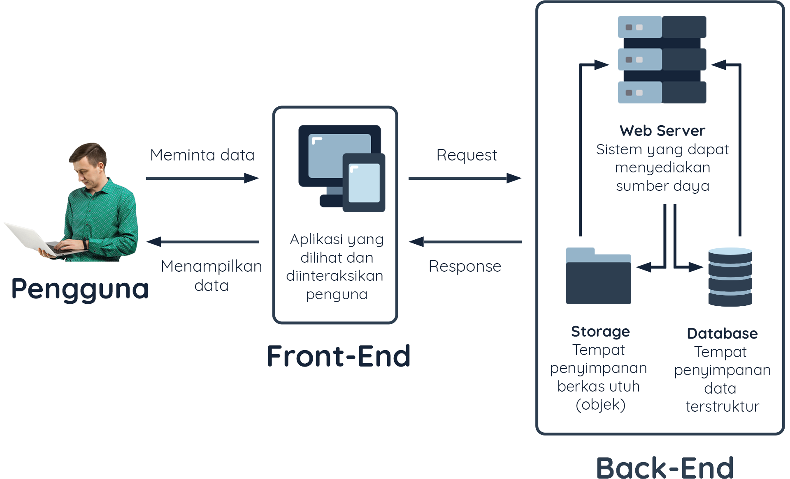

# Pengenalan ke Back-End

### Apa itu Back-End

Dalam pengembangan sistem aplikasi, pernahkah mendengar istilah _Front-End_ dan _Back-End_? Istilah tersebut terasa familiar, apalagi bila Anda baru terjun dalam bidang pemrograman. Faktanya, _Front-End_ dan _Back-End_ merupakan opsi bidang dalam profesi Software Developer. Anda perlu menentukan yang harus difokuskan. Lalu apa arti dari istilah-istilah itu dalam pengembangan aplikasi? Oke, Kita bahas dari _Front-End_ terlebih dahulu.

_Front-End_ merupakan bagian dari aplikasi yang terlihat dan digunakan langsung oleh pengguna \(_end-user_\). Orang yang menggeluti bidang ini disebut _Front-End Developer_. Aplikasi yang dibuat oleh seorang Front-End Developer dapat berupa web, _mobile native_, _desktop_, atau _platform_ lainnya. Di mana pun aplikasi berjalan, fokus utama seorang Front-End Developer adalah membangun aplikasi yang memiliki performa baik, mudah diakses, serta memiliki tampilan yang menarik.

Sedangkan **Back-End merupakan bagian dari aplikasi yang bertanggung jawab untuk menyediakan kebutuhan yang tak terlihat oleh pengguna** \(tidak berinteraksi langsung dengan pengguna\), seperti bagaimana data disimpan, diolah, serta ditransaksikan secara aman. Itu semua bertujuan untuk mendukung aplikasi Front-End bekerja sesuai dengan fungsinya. Sosok yang menggeluti bidang ini disebut _Back-End Developer._

Sistem aplikasi bekerja mirip seperti sistem bisnis pada dunia nyata. Agar lebih mudah memahami peran Back-End dan Front-End, mari analogikan sistem aplikasi layaknya sebuah bisnis kedai kopi.

Anggaplah Anda ingin membeli kopi di kedai kopi. Setelah sampai di kedai, hal pertama yang Anda lakukan adalah menuju kasir dan berbicara “Hallo, saya ingin memesan kopi.” Dengan ramah kasir menunjukan daftar kopi yang tersedia untuk Anda. “Saya mau kopi tubruk panas ukuran sedang.” ujar Anda, lalu kasir menulis pesanan Anda untuk diserahkan ke barista dan membuat tagihan pembayaran. Sambil menunggu kopi selesai dibuat, Anda duduk di kursi yang tersedia, dan menikmati alunan lagu yang diputar melalui speaker di sudut atap kedai kopi tersebut. Tak sampai 10 menit menunggu, seorang pelayan menghampiri tempat duduk Anda. Akhirnya kopi yang Anda pesan tiba! Pelayan tersebut meletakkan kopi beserta tagihan pembayaran yang harus Anda bayarkan.

Dari skenario tersebut apakah Anda bisa mengetahui bagian kedai kopi mana merupakan peran depan \(front-end\) dan peran belakang \(back-end\)? Jika masih bingung, ayo kita cari tahu.

Front-End berperan pada seluruh hal yang dapat Anda lihat, rasakan, dan interaksikan, termasuk pengalaman Anda saat berada di kedai kopi tersebut. Contohnya seperti susunan interior, kemudahan untuk memesan kopi, sifat ramah seorang kasir dan pelayan, hingga alunan musik yang Anda nikmati saat menunggu kopi datang. Di sini Front-End fokus memastikan Anda termudahkan, senang, dan nyaman saat berada di dalam kedai kopi. Pada sistem aplikasi pun demikian. Kenyamanan, keindahan, kemudahan akses, dan performa aplikasi yang baik menjadi tanggung jawab dari seorang Front-End Developer.

Lalu di mana peran Back-End? Karena Anda konsumen, tentu peran Back-End tak terlihat dan tidak diketahui oleh Anda. Contohnya seperti teknik barista membuat kopi, apa dan bagaimana cara mengoperasikan mesin kopi, laporan keuangan, biaya sewa kedai, dan hal-hal dapur tak terlihat pelanggan lainnya. Tentu Anda tak tahu menahu kan? Yang penting, kopi yang Anda pesan sampai di meja Anda. Walaupun tak terlihat oleh konsumen secara langsung, peran Back-End sangatlah vital untuk menunjang kedai kopi dapat tetap beroperasi. Dalam sebuah sistem aplikasi, segala urusan yang tak terlihat oleh pengguna seperti _bisnis logic_, _database_, keamanan data, kestabilan server menjadi tanggung jawab Back-End Developer.

Jadi sekarang Anda sudah tahu kan apa itu Back-End dan peranan dalam sebuah sistem aplikasi?

### Server

Meskipun Back-End dan Front-End terpisah dalam hal peran dan konsentrasi, namun keduanya harus saling terhubung secara lancar \(_seamless_\) agar aplikasi dapat berjalan dengan baik. Kembali ke analogi kedai kopi, ketika Anda memesan kopi tubruk di kasir, bagaimana informasi tersebut bisa sampai ke barista? Lalu bagaimana caranya kopi yang sudah dibuat barista sampai ke meja kita? Pasti ada perantara mengapa semuanya saling terhubung. Pada kedai kopi, penghubung itu adalah seorang pelayan.

Pelayan mencatat pesanan yang Anda inginkan kemudian mengirimnya ke barista. Setelah barista selesai membuat kopi, pelayan juga yang mengantarkan kopi dari barista ke meja Anda. Semua transaksi yang terjadi menggunakan perantara. Sebagai pelanggan, Anda tidak bisa masuk ke dapur dan meminta kopi langsung ke barista, karena hal tersebut tentu menyalahi prosedur.

Begitu pula dengan transaksi yang terjadi pada sistem aplikasi. Kita harus merancang sistem aplikasi dengan prosedur yang benar. Transaksi yang dilakukan Back-End ke Front-End harus melalui perantara. Front-End tidak boleh memiliki akses terhadap database secara langsung, begitu pula dengan Back-End yang sama sekali tidak boleh diakses secara langsung oleh pengguna \(end-user\). Pada sistem aplikasi, perantara tersebut dinamakan “server” yang posisinya serupa pelayan di kedai kopi.



### Apa itu Server?

Namun sebenarnya apa itu server? Server merupakan sebuah sistem yang dapat menyediakan sumber daya berupa data, layanan, atau program untuk disajikan ke komputer lain[\[1\]](https://www.paessler.com/it-explained/server). Ingat! Pengertian dari server bukanlah sebuah perangkat keras ataupun komputer, namun server sendiri lebih merujuk kepada sistem yang dapat membuat perangkat \(termasuk komputer\) dapat melayani sebuah permintaan dari perangkat lain. Jika diterjemahkan ke dalam Bahasa Indonesia, server memang berarti penyaji, atau pelayan.

Server bertugas untuk melayani sebuah layanan \(services\) atau jasa. Dalam dunia komputer ada banyak service yang dapat dilayani oleh server. Berikut beberapa tipe server sesuai dengan layanan yang baik untuk Anda ketahui.

* **File Server** : melayani penyimpanan dan pendistribusian berkas.
* **Application Server** : melayani hosting sebuah program atau aplikasi.
* **DNS Server** : mengubah nama domain \(contoh: dicoding.com\) ke dalam bentuk IP Address \(contoh: 75.2.21.170\).
* **Web Server** : melayani hosting sebuah program atau aplikasi \(seperti Application  Server\) yang dapat diakses oleh client melalui internet maupun intranet.
* **Database Server** : melayani penyimpanan dan pendistribusian data terstruktur.

Sebenarnya masih banyak lagi tipe server yang tidak disebutkan, namun Anda tidak perlu mengetahui itu semua saat ini. Ada satu tipe server yang perlu kita fokuskan sekarang, yakni server yang dapat berperan sebagai pelayan kedai kopi. Server apakah itu? Mari kita berkenalan lebih dalam dengan Web Server.

### Web Server dan Web Service

Kedai kopi memiliki Standar Operasional Prosedur \(SOP\) selama beroperasi. Kita tidak tahu apakah setiap kedai kopi memiliki SOP yang sama atau tidak. Yang kita ketahui secara umum kedai kopi memiliki pelayan sebagai perantara interaksi dari dapur ke pelanggannya. Kita juga tidak mengetahui proses apa yang terjadi ketika barista menyerahkan kopi buatannya ke pelayan. Apakah pelayan memastikan kopi yang dipesan sesuai? Atau diberikan ke pelanggan secara langsung tanpa melalui proses pengecekan? Hal ini hanya diketahui oleh pegawai kedai kopi saja. Sebagai pelanggan kita hanya menikmati hasil akhirnya, bukan?

Sama halnya seperti sistem aplikasi. Ketika Front-End meminta sesuatu hal ke Back-End, contohlah meminta data pembatalan transaksi yang terjadi selama bulan Januari, kita sebagai pengguna aplikasi tidak tahu proses apa yang terjadi di Back-End. Kita tidak tahu bahwa sebenarnya Back-End melakukan proses yang sangat rumit untuk memenuhi permintaan dari Front-End. Kita tidak tahu bahwa sebelum mulai mengeksekusi permintaan, Back-End sebenarnya perlu memvalidasi permintaan tsb untuk memastikan ia dapat menyanggupinya. Kita pun tidak tahu bagaimana proses bisnis di belakang berjalan. Hanya pemilik dan pengembang sistem aplikasi tersebut yang paham.

Bidang bisnis bolehlah sama, namun tidak menjamin SOP-nya sama juga. Perbedaan tersebut dipengaruhi oleh banyak faktor, contohnya model bisnis, letak geografis, target konsumen, tipe kopi atau makanan yang ditawarkan, ataupun faktor lainnya. SOP haruslah fleksibel sesuai dengan keadaan. Misal, tidak bisa SOP kedai kopi kelas atas diterapkan ke kedai kopi kelas-kelas bawah. Alhasil, jika dipaksakan, _gulung tikar_ lah bisnisnya.

Sistem untuk aplikasi pun demikian. Kita perlu membuat dan menjalankan program \(mirip seperti SOP\) agar dapat menentukan logika bisnis sesuai dengan kebutuhan. Program tersebut perlu disimpan di server dan dapat diakses secara remote melalui internet atau intranet agar aplikasi Front-End dan Back-End dapat saling terhubung. Jadi untuk membuat sistem aplikasi setidaknya membutuhkan:

* **Web Server** : Server yang dapat menjalankan program dan dapat diakses melalui internet atau intranet. 
* **Web Service** : Program yang dijalankan di web server agar kebutuhan bisnis terpenuhi.

Web service berjalan di dalam web server sehingga ia dapat diakses melalui internet. Melalui web service inilah aplikasi Front-End \(_client_\) dan Back-End dapat bertransaksi.

### Komunikasi Client-Server

HTTP/HTTPS merupakan salah satu protokol yang dapat digunakan untuk berinteraksi dengan web server. Protokol tersebut terkenal dengan pola _request-response_, artinya untuk mendapatkan sesuatu \(_response_\) kita perlu melakukan permintaan terlebih dahulu \(_request_\). Lagi-lagi ini menjadi pola yang sama ketika kita hendak memesan kopi di kedai kopi.

Ketika Anda ingin membeli kopi, tentu kopi yang diinginkan tidak secara ajaib datang sendiri. Anda sebagai pelanggan perlu mendatangi kasir atau pelayan untuk meminta \(_request_\) kopi yang diinginkan, pelayan meneruskan permintaan Anda ke barista, kemudian barista membuatkan kopi, dan memberikannya kembali \(respons\) ke pelayan untuk dihidangkan kepada Anda.


Pola yang sama dengan komunikasi client dengan server \(untuk memudahkan pemahaman, sebutlah client adalah Front-End, server adalah Back-End\) bila menggunakan protokol HTTP/S. Server tidak akan mengirimkan data apa pun apabila tidak ada permintaan dari client. Ketika client meminta sesuatu, barulah server akan menangga


_Ngomong-ngomong_ tentang permintaan \(_request_\), ketika hendak mengajukan permintaan kepada pelayan tentu Anda harus memberikan informasi jelas perihal apa yang ingin Anda minta. Contohnya bila meminta kopi, beritahu kopi apa yang ingin dipesan. Bila ingin menanyakan lokasi toilet, ucapkan “Di mana letak toilet?” Bila permintaan yang Anda ajukan tidak memiliki keterangan yang cukup, maka pelayan tidak dapat memproses permintaan Anda.


Begitu pula dengan request pada protokol HTTP di mana request yang diajukan client harus memiliki informasi-informasi yang cukup agar dapat dieksekusi oleh server. Informasi pada request dapat mengandung[\[2\]](https://www.ibm.com/docs/en/cics-ts/5.3?topic=protocol-http-requests):

* **Request line** : berisikan method/verb seperti GET \(mengambil data\), POST  \(menambahkan/mengirim data\), PUT \(memperbaharui data\), atau DELETE  \(menghapus data\); path atau alamat yang diminta; dan versi HTTP yang  digunakan.
* **Header** : memuat informasi  yang dilampirkan terkait request seperti format dokumen \(contoh  application/json, text/html, dsb\), kunci akses, dsb.
* **Body \(opsional\)** : mengandung data yang dibutuhkan oleh server, bisa dalam bentuk teks,  JSON, dll. Body tidak wajib dilampirkan bila server tidak membutuhkan  data apapun.

Apabila informasi yang dilampirkan pada request tidak jelas/sesuai, maka server akan menolaknya dengan respons negatif. Respons negatif? Apa itu?

Setiap request yang dilakukan, baik dengan informasi yang sesuai ataupun tidak, akan mendapatkan respons. Respons atau tanggapan yang dikirimkan dari server untuk client juga mengandung informasi. Berikut beberapa informasi yang dilampirkan oleh respons[\[3\]](https://www.ibm.com/docs/en/cics-ts/5.3?topic=protocol-http-responses):

* **Status line** : berisikan HTTP versi yang digunakan; status code berupa tiga digit  angka yang menandakan keberhasilan dari permintaan; reason phrase atau  status text yang merupakan pesan berdasarkan status code dalam bentuk  teks sehingga lebih mudah dimengerti.
* **Header** : mengandung informasi yang dilampirkan terkait response seperti format dokumen.
* **Body \(opsional, namun biasanya selalu dilampirkan\)** : memuat data yang dikirimkan oleh server. Data dapat berupa HTML, JSON, gambar, dsb.

Kembali ke istilah respons negatif, apa maksudnya? **Respons negatif merupakan respons dari server ketika sebuah permintaan dari client gagal dipenuhi**. Sama seperti di dunia nyata, ketika kita meminta kopi tubruk di kedai, namun permintaan kita tidak dapat kedai kopi penuhi sebab alasan teknis. Alih-alih mendapatkan kopi kita hanya mendapatkan pesan “maaf stok kopi habis” atau “maaf mesin kopi sedang rusak.”


Begitu pula dengan protokol HTTP. Bila kita meminta sesuatu yang tidak dapat server proses, maka kita tidak akan mendapatkan data yang diinginkan. Server akan memberikan respons negatif dengan alasan mengapa ia tidak bisa memenuhi permintaannya, contohnya seperti “Not Found”, “Bad Request” atau pesan lainnya.

Kita dapat mengetahui sebuah request berhasil atau tidak melalui status code yang dikirim oleh response. Sebuah request berhasil bila status code response diawali dengan angka 1, 2 atau 3, selain itu request gagal dieksekusi.

### Latihan Membuat Permintaan HTTP \(HTTP Request\)

Lantas seperti apa sih sebenarnya bentuk request dan respons pada HTTP? Penasaran? Mari kita coba membuat request pada web service kedai kopi melalui cURL. Silakan buka CMD atau Terminal pada komputer Anda.

> cURL atau Client URL merupakan software berbasis _command line_ yang dapat melakukan transaksi data melalui beberapa protokol internet, salah satunya HTTP/S. cURL dapat diakses secara langsung tanpa proses _install_ melalui Terminal \(Linux dan Mac\) atau CMD \(Windows\).\[4\]

Kita akan melakukan tiga skenario berikut:

* Meminta daftar kopi tersedia.
* Membeli kopi yang tersedia.
* Membeli kopi yang tidak tersedia.

Masuk ke skenario pertama, buatlah request untuk mendapatkan daftar kopi yang tersedia, tulislah kode berikut pada CMD atau Terminal Anda.

```bash
curl -X GET https://coffee-api.dicoding.dev/coffees -i
```

Kita bedah kodenya yuk:

* **curl** : merupakan perintah untuk menggunakan program cURL pada Terminal atau CMD.
* **-X GET** : menetapkan HTTP method/verb yang kita gunakan. GET berarti kita ingin mendapatkan sebuah data.
* [https://coffee-api.dicoding.dev/coffees](https://coffee-api.dicoding.dev/coffees) : merupakan alamat request yang dituju.
* **-i** : memberikan informasi detail terhadap response yang diberikan \(HTTP response headers\).

Setelah menuliskan kode tersebut, tekan enter. Anda akan mendapatkan respons dari web server seperti ini:

```http
HTTP/1.1 200 OK
Content-Type: application/json; charset=utf-8
Vary: Accept-Encoding
X-Powered-By: Express
Access-Control-Allow-Origin: *
ETag: W/"bc-+nGU6AB86aQxzJjdtoq2u1HQvyU"
X-Cloud-Trace-Context: 15ccf145d9c0d899c01b59c50e0f2e3o=1
Date: Sun, 03 Jan 2021 00:41:28 GMT
Server: Google Frontend
Content-Length: 188
Alt-Svc: h3-29=":443"; ma=2592000,h3-T051=":443"ma=2592000,h3-Q050=":443"; ma=2592000,h3-Q046=":443"ma=2592000,h3-Q043=":443"; ma=2592000,quic=":443"ma=2592000; v="46,43"

{"message":"Berikut daftar kopi yang tersedia","coffees"{"id":1,"name":"Kopi Tubruk","price":12000},{"id":"name":"Kopi Tarik","price":15000},{"id":3,"name":"KopJawa","price":18000}]}
```

Voila! Anda berhasil mendapatkan response pertama dari server. Fokus terhadap kode yang ditebalkan yah. Mari kita bedah sekarang.

* **HTTP/1.1** : merupakan HTTP version yang digunakan oleh web server dalam menanggapi permintaan.
* **200** : merupakan status code dari request. Karena status code diawali dengan angka 2, berarti request kita berhasil dilakukan.
* **OK** : merupakan pesan teks dari status code, 200 berarti “OK”.
* **Content-Type: application/json;** : merupakan tipe konten yang digunakan web server dalam memberikan  data. Karena nilainya application/json, itu berarti server menggunakan  format json.
* **JSON Data \(kode di bagian bawah\)** : merupakan data yang diberikan oleh web server. Kita bisa melihat web  server memberikan informasi kopi yang tersedia beserta harganya  menggunakan format JSON.

Skenario pertama selesai! Mudah bukan untuk melakukan request melalui protokol HTTP?

Lanjut ke skenario kedua yuk. Buat permintaan membeli kopi yang tersedia dengan menuliskan perintah berikut:

```bash
curl -X POST -H "Content-Type: application/json" -d "{\"name\": \"Kopi Tubruk\"}" https://coffee-api.dicoding.dev/transactions -i
```

Jika dilihat, kode yang dituliskan memiliki struktur yang sama, namun ada beberapa perbedaan. Mari kita bedah:

* **-X POST** : dalam request kali ini kita menggunakan method POST. Karena membeli  bukan hanya meminta data, tapi akan mengubah jumlah stok kopi yang ada.  Selain itu kita juga melampirkan data berupa kopi apa yang akan dipesan. Sehingga tidak masuk akal bila kita menggunakan GET request.
* **-H “Content-Type: application/json”** : Menetapkan nilai “Content-Type: application/json” pada Header  request. Fungsinya untuk memberitahu server bahwa kita melampirkan data  dalam bentuk JSON.
* **-d**  : merupakan data yang dilampirkan pada request. Data ini berformat JSON dan memiliki informasi kopi apa yang ingin dipesan.
* [https://coffee-api.dicoding.dev/transactions](https://coffee-api.dicoding.dev/transactions) : Merupakan alamat request yang dituju untuk membeli kopi.

Setelah menuliskan perintah di atas, silakan tekan enter. Anda akan mendapatkan respons seperti ini dari web server:

```http
HTTP/1.1 200 OK
Content-Type: application/json; charset=utf-8
Vary: Accept-Encoding
X-Powered-By: Express
Access-Control-Allow-Origin: *
ETag: W/"2e-a65Yb2UyToE5h4vnZNUuPzDX90c"
X-Cloud-Trace-Context: 59cdf8e8238b684818cd4315bd9b7efo=1
Date: Sun, 03 Jan 2021 02:45:21 GMT
Server: Google Frontend
Content-Length: 46
Alt-Svc: h3-29=":443"; ma=2592000,h3-T051=":443"ma=2592000,h3-Q050=":443"; ma=2592000,h3-Q046=":443"ma=2592000,h3-Q043=":443"; ma=2592000,quic=":443"ma=2592000; v="46,43"

{"message":"Pesanan berhasil!","success":true}
```

Fokus terhadap kode yang diberi tanda tebal. Anda sudah bisa membaca hasilnya kan? Yups, Pesanan kopi berhasil!

Lanjut ke skenario terakhir, yakni membeli kopi yang tidak tersedia. Tuliskan perintah yang sama seperti sebelumnya. Namun dengan tipe kopi yang tentunya tidak tersedia pada daftar. Contohnya Kopi Luwak.

```bash
curl -X POST -H "Content-Type: application/json" -d "{\"name\": \"Kopi Luwak\"}" https://coffee-api.dicoding.dev/transactions -i
```

Silakan tulis perintahnya, kemudian tekan enter. Kali ini Anda akan mendapatkan response seperti ini.

```http
HTTP/1.1 404 Not Found
Content-Type: application/json; charset=utf-8
Vary: Accept-Encoding
X-Powered-By: Express
Access-Control-Allow-Origin: *
ETag: W/"42-WP2gTxT4eLOmvee44xnev3QcFoE"
X-Cloud-Trace-Context: cee054c7dd8147e341d0c509ca7f676o=1
Date: Sun, 03 Jan 2021 03:01:51 GMT
Server: Google Frontend
Content-Length: 66
Alt-Svc: h3-29=":443"; ma=2592000,h3-T051=":443"ma=2592000,h3-Q050=":443"; ma=2592000,h3-Q046=":443"ma=2592000,h3-Q043=":443"; ma=2592000,quic=":443"ma=2592000; v="46,43"

{"message":"Pesanan gagal, kopi tidak ditemukan!"success":false}
```

Fokus pada kode yang ditebalkan. Lihat status code-nya, kali ini Anda mendapatkan respons negatif _lho_! Request yang Anda lakukan tidak dapat diproses oleh server karena kopi luwak tidak ada \(_not found_\) pada daftar kopi.

Nah melalui latihan tadi, semoga Anda semakin mengerti yah bagaimana client dan server berkomunikasi melalui protokol HTTP.

### REST Web Service

Dalam mengembangkan web service Anda perlu menetapkan arsitektur apa yang hendak diadaptasi. Dengan menetapkan arsitektur, client, dan server lebih mudah dalam berkomunikasi karena memiliki pola atau gaya yang konsisten. Salah satu arsitektur web service yang banyak digunakan saat ini adalah _REST_.

REST atau **RE**presentational **S**tate **T**ransfer adalah salah satu gaya arsitektur yang dapat diadaptasi ketika membangun web service. Arsitektur ini sangat populer digunakan karena pengembangannya yang relatif mudah. REST menggunakan pola request-response dalam berinteraksi, artinya ia memanfaatkan protokol HTTP seperti yang sudah kita pelajari di materi sebelumnya.

Dalam implementasinya arsitektur REST benar-benar memisahkan peran client dan server, bahkan keduanya tidak harus saling mengetahui. Artinya ketika terjadi perubahan besar di sisi client, tidak akan berdampak pada sisi server, begitu juga sebaliknya.

#### REST API

Sebagian dari kalian mungkin mengenal REST dengan sebutan RESTful API. Yups, memang benar! RESTful merupakan sebutan untuk web services yang menerapkan arsitektur REST. REST juga merupakan API \([_application program interface_](https://id.wikipedia.org/wiki/Antarmuka_pemrograman_aplikasi)\) karena ia digunakan untuk menjembatani antara sistem yang berbeda \(client dan server\).

> API atau Application Program Interface merupakan antarmuka yang menjadi perantara antara sistem aplikasi yang berbeda. API tak hanya dalam bentuk Web Service, bisa saja berupa SDK \(Software Development Kit\) ataupun lainnya.

Berikut beberapa sifat yang menjadi kunci pada REST API.

* **Client-Server** : Ini merupakan hal yang paling mendasar dalam membangun REST API.  Server harus bisa merespons permintaan yang dilakukan client, baik itu  respons berhasil ataupun gagal. Komunikasi client dan server dilakukan  melalui protokol HTTP.
* **Stateless** :  REST API tidak boleh menyimpan keadaan \(state\) apa pun terkait client.  Seluruh state harus tetap disimpan di client. Artinya, tidak ada session di REST API. Permintaan yang dilakukan client harus mengandung  informasi yang jelas. Jangan berharap RESTful API akan menyimpan  informasi dari permintaan sebelumnya untuk digunakan di permintaan  selanjutnya.
* **Cacheable** : Agar dapat  merespons permintaan dengan cepat, sebaiknya REST API menerapkan prinsip cache. Sehingga setiap permintaan tidak melulu mengambil dari database.
* **Layered** : Ketika REST API server memiliki arsitektur yang kompleks, client seharusnya tidak perlu tahu bagaimana server melayaninya.

Selain itu, sebelum membangun REST API, kita perlu mengenal dahulu bagaimana konsep-konsep penting yang harus diterapkan dalam membangun arsitektur ini. Apa saja?

Singkatnya, ketika membangun REST API kita harus memperhatikan empat poin berikut:

* Format request dan response.
* HTTP Verbs/Methods.
* HTTP Response code.
* URL Design.

Yuk kita bahas lebih detail poin-poin tersebut pada materi selanjutnya.

### Format Request dan Response

REST API seringnya menggunakan JavaScript Object Notation atau JSON sebagai format data baik itu pada request ataupun response. JSON merupakan salah satu format standar dalam transaksi data. Bahkan, saat ini JSON menjadi format terpopuler mengalahkan pendahulunya yaitu [XML](https://id.wikipedia.org/wiki/XML).

> Sebenarnya Anda bisa menggunakan XML pada REST API, namun sebaiknya gunakan JSON agar lebih mudah dibaca dan efisien dalam transaksi data.

Agar REST API selalu merespons dengan format JSON, pastikan setiap respons terdapat properti Content-Type dengan nilai application/json.

Seperti namanya, JSON memiliki struktur seperti JavaScript Object yakni menggunakan _key-value_. Bedanya, key pada JSON selalu dituliskan menggunakan tanda kutip dua \(“”\). Value pada JSON dapat menampung nilai primitif seperti string, number, boolean, atau nilai non primitif seperti object atau array.

Pada latihan sebelumnya Anda sudah melihat bagaimana bentuk JSON ketika mengirimkan data pembelian kopi dan data pada body respon dari server. Berikut contoh struktur JSON ketika melakukan GET request terhadap url [https://coffee-api.dicoding.dev/coffees](https://coffee-api.dicoding.dev/coffees):

```javascript
{
  "message": "Berikut daftar kopi yang tersedia",
  "coffees": [
    {
      "id": 1,
      "name": "Kopi Tubruk",
      "price": 12000
    },
    {
      "id": 2,
      "name": "Kopi Tarik",
      "price": 15000
    },
    {
      "id": 3,
      "name": "Kopi Jawa",
      "price": 18000
    }
  ]
}
```

Walaupun memiliki nama JavaScript Object Notation, bukan berarti kita harus menggunakan JavaScript untuk mengolah data dengan format JSON. Format JSON dapat digunakan oleh hampir semua bahasa pemrograman yang ada.

### HTTP Verbs/Methods

Karena REST API menggunakan protokol HTTP, kita dapat memanfaatkan HTTP verbs untuk menentukan aksi.

GET untuk mendapatkan data, POST untuk mengirimkan data baru, PUT untuk memperbarui data yang ada, dan DELETE untuk menghapus data. Verbs tersebutlah yang umum digunakan dalam operasi **CRUD**.

### HTTP Response Code

Status-Line merupakan salah satu bagian dari HTTP Response. Di dalam status line terdapat response code yang mengindikasikan bahwa permintaan yang client lakukan berhasil atau tidak. Karena itu, ketika membangun REST API kita perlu memperhatikan dan menetapkan response code secara benar.

Status code bernilai 3 digit angka. Pada REST API, berikut nilai-nilai status code yang sering digunakan:

* **200** \(OK\) - Permintaan client berhasil dijalankan oleh server.
* **201** \(Created\) - Server berhasil membuat/menambahkan resource yang diminta client.
* **400** \(Bad Request\) - Permintaan client gagal dijalankan karena proses validasi input dari client gagal.
* **401** \(Unauthorized\) - Permintaan client gagal dijalankan. Biasanya ini disebabkan karena pengguna belum melakukan proses autentikasi.
* **403** \(Forbidden\) - Permintaan client gagal dijalankan karena ia tidak memiliki hak akses ke resource yang diminta.
* **404** \(Not Found\) - Permintaan client gagal dijalankan karena resource yang diminta tidak ditemukan.
* **500** \(Internal Server Error\) -  Permintaan client gagal dijalankan karena server mengalami eror \(membangkitkan Exception\).

Ketika permintaan client gagal dijalankan, kita harus mengembalikan status code yang sesuai dengan kesalahan yang terjadi. Penggunaan response code yang tepat dapat meminimalisir kebingungan client/user dalam memanfaatkan API.

### URL Design

URL, Path, atau Endpoint merupakan salah satu bagian terpenting yang harus diperhatikan ketika membangun REST API. Dengan merancang endpoint yang baik, penggunaan API akan lebih mudah dipahami. Dalam merancang endpoint, ikutilah aturan umum atau convention agar penggunaan API kita memiliki standar yang diharapkan oleh banyak developer. Lalu, seperti apa standar dalam merancang endpoint?

#### Gunakan Kata Sifat daripada Kata Kerja pada Endpoint Path

Hindari penggunaan kata kerja dalam menetapkan nama endpoint \(titik akhir path\). Contohnya /getArticles atau /addArticles. Karena aksi dapat ditentukan secara jelas melalui HTTP Verb, kita tidak perlu lagi menambahkan kata kerja di endpoint. Dengan adanya HTTP verbs Anda cukup memberikan endpoint GET /articles untuk mendapatkan data artikel atau POST /articles untuk menambahkan artikel.

#### Gunakan Kata Jamak pada Endpoint untuk Resource Collection

Selalu gunakan kata jamak \(plural\) saat memberikan nama endpoint. Ini karena jarang ada data yang hanya memiliki satu item. Dengan menggunakan kata jamak, kita menjadi konsisten dengan apa yang ada di database. Karena tabel pada database pun biasanya memiliki lebih dari satu record \(data\).

Lalu, bagaimana bila ingin mengakses satu data saja? Contohnya mendapatkan satu artikel secara spesifik?

Gunakan path parameter untuk mendapatkan data spesifik. Endpoint /articles/:id merupakan contoh yang baik untuk mendapatkan artikel secara spesifik berdasarkan id. Kita akan membahas dan menggunakan path parameter nanti ketika latihan membuat web server.

#### Gunakan Endpoint berantai untuk resource yang memiliki hirarki/relasi

Endpoint dari resource yang memiliki hirarki/relasi sebaiknya dituliskan secara berantai. Contohnya untuk mendapatkan daftar komentar dari sebuah artikel, endpoint GET /articles/:id/comments merupakan contoh yang tepat.

Penggunaan endpoint tersebut masuk akal karena untuk mendapatkan comments pada respons, kita perlu tahu komentar pada artikel mana yang akan ditampilkan. Prinsip ini juga memperjelas permintaan dari client hanya dengan melihat endpoint yang dituju, daripada menggunakan endpoint GET /comments kemudian memberikan nilai id artikel pada request body.

Tidak hanya GET, prinsip ini juga cocok diterapkan pada HTTP verb POST, PUT, maupun DELETE.

## Ikhtisar

Anda berada di akhir dari modul Pengenalan Back-End. Mari kita uraikan materi yang sudah Anda pelajari untuk mempertajam pemahaman.

* Anda sudah mengetahui istilah Back-End dan Front-End Developer. 
* Anda sudah mengetahui apa itu server.
* Anda sudah mengetahui bagaimana server dan client berkomunikasi.
* Anda sudah mencoba berkomunikasi dengan server melalui cURL sebagai client.
* Anda sudah mengetahui apa itu web server dan web service.
* Anda sudah mengetahui REST API sebagai salah satu arsitektur dalam membangun web service.
* Anda sudah mengetahui format yang digunakan dalam tanggapan \(respons\) dan  mengirimkan permintaan \(request\) pada arsitektur REST API.
* Anda sudah mengetahui penggunaan dari HTTP verbs/method dari REST API.
* Anda sudah mengetahui HTTP Response Code dan cara penggunaan code yang tepat.
* Anda sudah mengetahui bagaimana mendesain URL pada REST API dengan baik.

Dengan ringkasan tersebut, diharapkan Anda dapat memahami semua materi yang telah disampaikan. Jika belum, Anda bisa ulas kembali materi yang diberikan pada modul ini dan juga menanyakannya di [forum diskusi](https://www.dicoding.com/academies/261/discussions). Untuk Anda yang sudah merasa mantap, yuk lanjut ke modul berikutnya!

## Referensi:

\[1\]: Paessler, “Server,” Paessler, _Server - Definition and details_. \[Daring\]. Tersedia: [https://www.paessler.com/it-explained/server](https://www.paessler.com/it-explained/server). \[Diakses: 01-Mar-2021\].

\[2\]: IBM, _IBM Knowledge Center_. \[Daring\]. Tersedia: [https://www.ibm.com/support/knowledgecenter/SSGMCP\_5.3.0/com.ibm.cics.ts.internet.doc/topics/dfhtl21.html](https://www.ibm.com/support/knowledgecenter/SSGMCP_5.3.0/com.ibm.cics.ts.internet.doc/topics/dfhtl21.html). \[Diakses: 01-Mar-2021\].

\[3\]: IBM, _IBM Knowledge Center._ \[Daring\]. Tersedia: [https://www.ibm.com/support/knowledgecenter/SSGMCP\_5.3.0/com.ibm.cics.ts.internet.doc/topics/dfhtl22.html](https://www.ibm.com/support/knowledgecenter/SSGMCP_5.3.0/com.ibm.cics.ts.internet.doc/topics/dfhtl22.html). \[Diakses: 01-Mar-2021\].

\[4\]: Badger, _“The name,” Everything curl_. \[Daring\]. Tersedia: [https://everything.curl.dev/project/name](https://everything.curl.dev/project/name). \[Diakses: 01-Mar-2021\].

